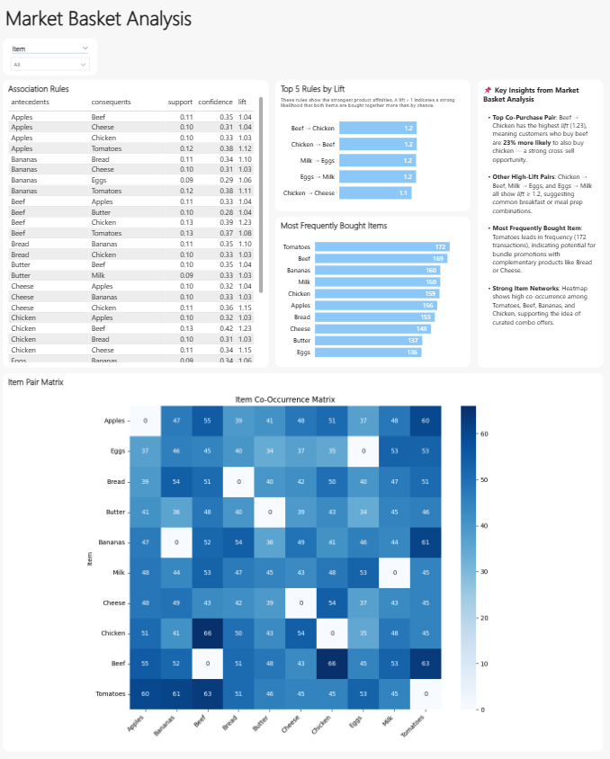

# 🛒 Market Basket Analysis

This project performs market basket analysis on retail transaction data to identify product associations using Apriori and FP-Growth algorithms.  
It also delivers a business-friendly dashboard in **Power BI** for actionable insights.

---

## 📌 Problem Statement

Retailers can benefit from knowing which products are frequently bought together. Market Basket Analysis helps improve cross-selling strategies, product placement, and promotions.

---

## 📊 Power BI Dashboard

The `.pbix` dashboard visualizes key market basket metrics:

- Top 5 rules by lift
- Most frequently bought items
- Item co-occurrence heatmap matrix
- Full rule table with support, confidence, and lift

🔽 **Download the report:** [`market_basket_analysis_report.pbix`](reports/market_basket_analysis_report.pbix)  
🖼️ **Preview:**



---

## 🛠️ Tech Stack

- Python (Pandas, Mlxtend, Efficient-Apriori, FP-Growth)
- Jupyter Notebooks
- Power BI (or Matplotlib/Seaborn if staying within Python)
- Git & GitHub for version control

---

## 📁 Project Structure

```
market-basket-analysis/
├── data/ # Raw + processed datasets
├── notebooks/ # Jupyter analysis notebooks
├── reports/ # PBIX dashboard + preview image
├── src/ # Future modular Python scripts
└── README.md
```

---

## 🚀 Key Features

- Transaction data preprocessing
- Frequent itemset mining with support, confidence, lift
- Association rule generation using Apriori
- Power BI dashboard for business decision-makers

---

## 🏅 Author & Certifications

**Felipe Castro**  
Analytics Engineer @ EPAM Systems  

📜 [PL-300: Power BI Data Analyst](https://learn.microsoft.com/api/credentials/share/en-us/FelipeCastro-8026/F853AABE365874B3?sharingId=13D660F56C1DFFA3)  
📜 [DP-600: Fabric Analytics Engineer](https://learn.microsoft.com/api/credentials/share/en-us/FelipeCastro-8026/6C5A2F5A8A5864FC?sharingId=13D660F56C1DFFA3)
